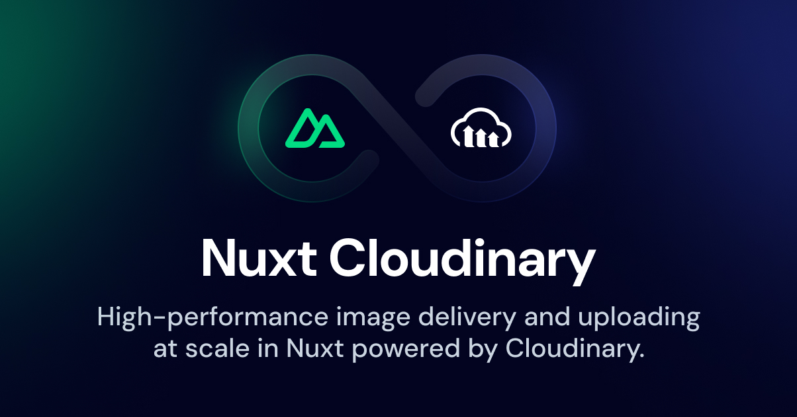

[](https://v2.cloudinary.nuxtjs.org)

# @nuxtjs/cloudinary

[![npm version][npm-version-src]][npm-version-href]
[![npm downloads][npm-downloads-src]][npm-downloads-href]
[![Github Actions CI][github-actions-ci-src]][github-actions-ci-href]
[![Codecov][codecov-src]][codecov-href]
[![License][license-src]][license-href]

> [Cloudinary](https://cloudinary.com) integration with for [Nuxt](https://nuxt.com)

- [📖 &nbsp;Documentation](https://v2.cloudinary.nuxtjs.org)
- [👾 &nbsp;Playground](https://stackblitz.com/github/nuxt-modules/cloudinary?file=.stackblitz%2Fnuxt.config.ts)

> This is a module for version 3.X of Nuxt. If you are looking for Nuxt 2.X support check out the following [branch](https://github.com/nuxt-modules/cloudinary/tree/v1.x.x) and the legacy documentation [here](https://v1.cloudinary.nuxtjs.org)

## Features

- Nuxt 3 ready
- Useful `CldImage.vue` component
- Handy `useCldImageUrl` composable
- Automatically optimize images and deliver in modern formats
- Remove backgrounds from images
- Dynamically add image and text overlays to images

[📖 &nbsp;Read more](https://v2.cloudinary.nuxtjs.org)

## Quick Setup

1. Add `@nuxtjs/cloudinary` dependency to your project

```bash
yarn add @nuxtjs/cloudinary 
npm install @nuxtjs/cloudinary
```

2. Add `@nuxtjs/cloudinary` to the `modules` section of `nuxt.config.ts`

```js
export default defineNuxtConfig({
  modules: ['@nuxtjs/cloudinary'],
})
```

See [module options](https://v2.cloudinary.nuxtjs.org/options) for more configuration options.

3. Create .env file with following `CLOUDINARY_CLOUD_NAME` variable:

```bash
CLOUDINARY_CLOUD_NAME=<YOUR_CLOUDINARY_CLOUD_NAME>
```

And that's it! You can now use Clodinary in Nuxt ✨

```html
<template>
  <CldImage
    src="cld-sample-5.jpg"
    width="987"
    height="987"
  />
</template>
```

## Development

1. Clone this repository
2. Install dependencies using `yarn install` or `npm install`
3. Start development server using `npm run dev`

## License

[MIT License](./LICENSE)

<!-- Badges -->
[npm-version-src]: https://img.shields.io/npm/v/@nuxtjs/cloudinary/latest.svg
[npm-version-href]: https://npmjs.com/package/@nuxtjs/cloudinary

[npm-downloads-src]: https://img.shields.io/npm/dt/@nuxtjs/cloudinary.svg
[npm-downloads-href]: https://npmjs.com/package/@nuxtjs/cloudinary

[github-actions-ci-src]: https://github.com/nuxt-modules/cloudinary/workflows/ci/badge.svg
[github-actions-ci-href]: https://github.com/nuxt-modules/cloudinary/actions?query=workflow%3Aci

[codecov-src]: https://img.shields.io/codecov/c/github/nuxt-modules/cloudinary.svg
[codecov-href]: https://codecov.io/gh/nuxt-modules/cloudinary

[license-src]: https://img.shields.io/npm/l/@nuxtjs/cloudinary.svg
[license-href]: https://npmjs.com/package/@nuxtjs/cloudinary
